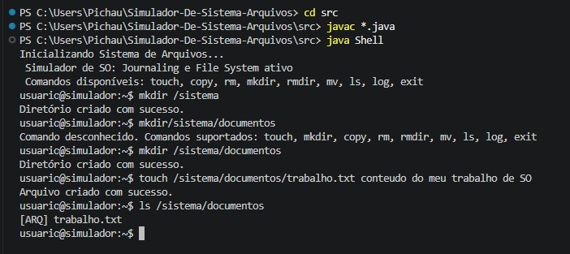
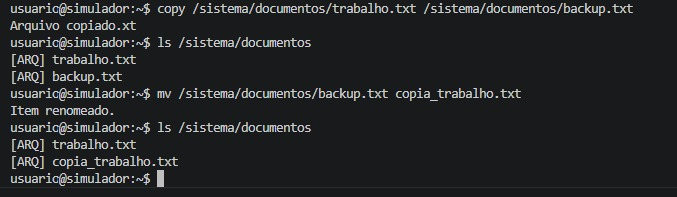
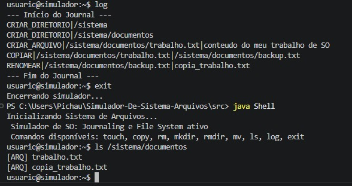

# Relatório de Implementação: Simulador de Sistema de Arquivos com Journaling

**Dupla:** Lara Stephanny Lima Gomes, Matheus Martins da Costa Lima
**Disciplina:** Sistemas Operacionais  
**Repositório GitHub:** [https://github.com/LaraSLGomes/Simulador-De-Sistema-Arquivos](https://github.com/LaraSLGomes/Simulador-De-Sistema-Arquivos)

---

## Metodologia

O presente projeto consiste no desenvolvimento de um simulador de sistema de arquivos escrito na linguagem Java. A arquitetura foi construída para receber comandos equivalentes aos de um terminal de Sistema Operacional (SO) real, processando os parâmetros inseridos pelo usuário e chamando os métodos correspondentes na API do simulador. 

Cada funcionalidade foi implementada para refletir operações reais de disco (criação, leitura, deleção, cópia e movimentação de arquivos/diretórios). O programa executa cada comando em memória e exibe o resultado ou feedback da operação diretamente na tela (console), mantendo a persistência das ações através de um mecanismo integrado de *Journaling*.

---

## Parte 1: Introdução ao Sistema de Arquivos com Journaling

### Descrição do Sistema de Arquivos
Um sistema de arquivos é a estrutura lógica e o conjunto de regras que um Sistema Operacional utiliza para organizar, armazenar e recuperar dados em um dispositivo de armazenamento (como um HD ou SSD). Sem ele, os dados seriam apenas um bloco contínuo de informações sem início, fim ou identificação. O sistema de arquivos abstrai essa complexidade, permitindo que os dados sejam visualizados de forma hierárquica através de diretórios e arquivos.

### Journaling
O *Journaling* é um recurso crítico para a integridade dos dados. Em sistemas de arquivos tradicionais, uma queda de energia durante uma gravação pode corromper o disco. Com o journaling, o SO registra as intenções de modificação em uma área de log (o *journal*) antes de efetivamente alterar os dados principais.

**Tipos comuns de Journaling:**
* **Write-Ahead Logging (WAL):** O log das operações é gravado no disco antes da alteração dos dados reais. Se houver falha, o sistema lê o log e refaz (ou desfaz) as transações incompletas. Este foi o conceito central simulado em nosso trabalho.
* **Log-structured:** Todo o sistema de arquivos é tratado como um grande log circular, otimizando escritas rápidas, mas exigindo processos de limpeza (*garbage collection*) em background.

---

## Parte 2: Arquitetura do Simulador

### Estrutura de Dados
Para representar a hierarquia do sistema de arquivos de forma eficiente, adotamos o padrão de projeto **Composite**. As estruturas de dados principais são:
* **Árvore Hierárquica:** O sistema é uma grande árvore onde a raiz (`/`) é o nó principal.
* **Nós Genéricos (`FSNode`):** Uma classe abstrata que define atributos comuns (como `nome` e referência ao diretório `pai`).
* **Nós Específicos (`File` e `Directory`):** * Um `Directory` contém uma coleção (`LinkedHashMap`) de outros nós, permitindo a navegação e listagem ordenada de arquivos e subdiretórios.
    * Um `File` representa as folhas da árvore, armazenando propriedades básicas e o `conteúdo` (texto).

### Journaling
O log foi implementado através de um arquivo de texto simples (`disco_journal.log`). O funcionamento ocorre em duas etapas:
1.  **Registro:** Antes de qualquer alteração na árvore em memória, a classe de *Journal* formata a operação em uma string (ex: `CRIAR_ARQUIVO|/docs/texto.txt|conteudo`) e realiza o *append* no arquivo de log.
2.  **Recuperação (Replay):** Ao inicializar o simulador, o sistema lê o log linha por linha e reconstrói o estado exato da árvore de arquivos, simulando a inicialização de um SO montando o disco.

---

## Parte 3: Implementação em Java

O projeto foi dividido em classes de responsabilidade única:

* **Classe `FileSystemSimulator`:** Atua como o "Kernel" do nosso simulador. É responsável por rotear as chamadas públicas para gravação no *Journal* e, em seguida, executar os métodos privados que manipulam as estruturas em memória (criar, deletar, renomear, listar e copiar).
* **Classes `File` e `Directory`:** Representam a abstração física dos dados. O `Directory` gerencia as inserções e remoções de nós filhos, enquanto o `File` retém os dados do arquivo simulado. Ambos herdam da superclasse `FSNode`.
* **Classe `Journal`:** Gerencia as operações de I/O reais no sistema hospedeiro. Ela encapsula a lógica de criar o arquivo de log, registrar (escrever) as novas operações de forma segura e ler o histórico para a reconstrução do estado.
* **Classe `Shell` (Modo Avançado):** Interface de linha de comando iterativa que captura as entradas do usuário, realiza o *parsing* dos comandos e aciona o `FileSystemSimulator`.

---

## Parte 4: Instalação e Funcionamento

### Pré-requisitos
* Java Development Kit (JDK) versão 11 ou superior instalado na máquina.
* Terminal (Prompt de Comando, PowerShell, ou Bash).

### Passo a Passo para Execução
1.  Clone o repositório ou faça o download dos arquivos `.java` para uma pasta local:
    ```bash
    git clone [https://github.com/LaraSLGomes/Simulador-De-Sistema-Arquivos](https://github.com/LaraSLGomes/Simulador-De-Sistema-Arquivos)
    cd nome-do-repositorio
    ```
2.  Compile todos os arquivos Java:
    ```bash
    javac *.java
    ```
3.  Inicie o Simulador no Modo Shell:
    ```bash
    java Shell
    ```

### Uso do Simulador
Uma vez no terminal do simulador (`usuario@simulador:~$ `), você pode utilizar os seguintes comandos:
* `touch /caminho/arquivo [conteúdo]` - Cria um arquivo (com texto opcional).
* `mkdir /caminho/pasta` - Cria um novo diretório.
* `copy /caminho_origem /caminho_destino` - Copia um arquivo.
* `rm /caminho` ou `rmdir /caminho` - Remove um arquivo ou diretório vazio.
* `mv /caminho novo_nome` - Renomeia um nó.
* `ls /caminho` - Lista o conteúdo de um diretório ou lê um arquivo.
* `log` - Exibe o histórico de operações salvas pelo Journaling.
* `exit` - Encerra o simulador.

---

## Resultados Esperados e Conclusão

A execução e validação do simulador demonstraram, na prática, como o conceito de hierarquia de diretórios se sustenta através de referências encadeadas em memória. Mais importante, o mecanismo de *Journaling* comprovou sua utilidade: ao fechar o programa e abri-lo novamente, o processo de leitura do arquivo de log demonstrou como os Sistemas Operacionais modernos garantem a tolerância a falhas e a resiliência dos dados após reinicializações não planejadas. Este desenvolvimento proporcionou uma visão consolidada sobre o funcionamento interno das chamadas de sistema, a manipulação de estruturas em árvore e a importância do registro prévio de transações em disco.

*1. Criação de Arquivos e Diretórios*
Aqui testamos os comandos touch e mkdir para montar a estrutura inicial.


*2. Movimentação e Listagem*
Teste dos comandos mv e ls, demonstrando que a árvore de diretórios é atualizada corretamente em memória.


*3. Validação do Journaling (Replay)*
Após forçar o encerramento do simulador, o comando log demonstra que as operações foram gravadas no disco e o estado foi recuperado com sucesso.
